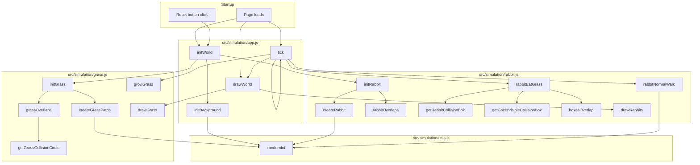

# school-project-ecosystem

## To-Do List

### Core Simulation
- [x] Växter växer
- [ ] Ett djur dör om den inte äter tillräckligt mycket (om organsimen inte ätar -> mer hunger -> svält -> hälsa minskas konstant -> död )
- [ ] Varje organism behöver en viss typ av näring för att överleva, varje organsim har också en viss typ av näring (exempel: gräs behöver jord och vatten och solljus)
- [ ] Organsimer kan bli mätta -> de slutar äta 
- [ ] Energinivå (för att springa)
- [ ] Ålder 
- [ ] Förökning
- [ ] Kön
- [ ] Sjukdomar (ärftligt)

### Food Chain
- [ ] Köttätare som äter växtätare
- [ ] Allätare
- [ ] Insekter?
- [ ] Det döda djuret tas upp av nedbrytare -> växter växer snabbare i närheten

### Behavior and AI
- [ ] Växtätare springer iväg från köttätare
- [ ] Djur kan bara se i en viss sträcka (beror på genetik och väder, alltså slump)
- [ ] Djur kan varna andra av samma art för hot (de springer om den springer iväg)

### World Systems
- [ ] Vatten som djur kan dricka ur
- [ ] Temperatur
- [ ] Väder (regn, sol, dimma)
- [ ] Dag- och nattcykel
- [ ] Olika klimat (öken, regnskog, osv)
- [ ] Årstider (långsam övergång mellan de)

### Tools and UX
- [ ] Statistik medan simuleringen sker
- [ ] Ett enkelt sätt att ändra alla olika funktioner (väder, temperatur, klimat, osv)

### Expansion
- [ ] Invasiva arter

### Conversion to real life 

	Definition: En kanin behöver 2,5 m^2 gräs per dag för att överleva.
	Om det finns 10 kaniner behöver populationen totalt 25 m^2 gräs per dag.
	Det finns 400 gräsplättar, så om konsumtionen fördelas jämnt blir det:
	25 / 400 = 0,0625 m^2 per plätt och dag.

	Skalning som används i simuleringen:
	En fullvuxen gräsplätt ritas som en cirkel med radie 10 px (bredd 20 px → r = 10 px).
	Pixelarea per plätt: A = pi * 10^2 ≈ 314 px^2.
	400 plättar täcker ca 400 * 314 = 125 600 px^2 av canvasens 480 000 px^2,
	vilket ger en täckningsgrad på ~26 %.

	Om plättarna täcker 26 % av canvasen och den ytan motsvarar 25 m^2 gräs, då är:
	Total canvas-area = 25 / 0,26 ≈ 96 m^2.
	Canvas är 800 * 600 px = 480 000 px^2, alltså:
	1 px^2 = 96 / 480 000 m^2 = 0,0002 m^2.
	1 px ≈ sqrt(0,0002) m ≈ 0,0141 m ≈ 1,4 cm.

	Canvasen föreställer alltså ett område på ungefär 11 m * 8 m — rimlig naturmark för 10 kaniner.

### Goal
Mitt mål med det här projektet är att skapa en bra simulering som simulerar ett ekosystem basert på olika faktorer. Resultaten kommer användas till att undersöka hur ett ekosystem fungerar. 

## Function Relationship Diagram

Diagrammet nedan visar hur funktionerna i de aktiva skripten hänger ihop. index.html laddar src/main.js som i sin tur laddar skripten i src/simulation.

Kort förklaring:

- initWorld startar om världen genom att skapa gräs, bakgrund och kaniner.
- tick är huvudloopen som flyttar kaniner, låter dem äta gräs, växer gräs och ritar om världen varje bildruta.
- rabbitEatGrass använder hjälpfunktioner för kollisionskontroll mellan kaniner och synlig gräsyta.
- randomInt i src/simulation/utils.js används av gräs, kaniner och bakgrund för slumpmässiga värden.
- Diagrammet visar bara de skript som faktiskt används av sidan just nu.