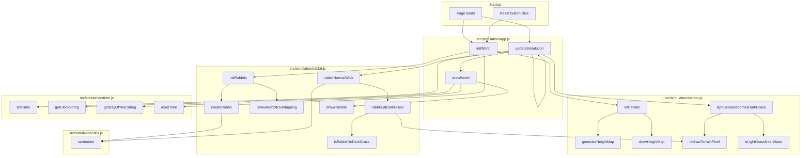

# school-project-ecosystem

## To-Do List

### Core Simulation
- [x] Växter växer
- [ ] Ett djur dör om den inte äter tillräckligt mycket (om organsimen inte ätar -> mer hunger -> svält -> hälsa minskas konstant -> död )
- [ ] Varje organism behöver en viss typ av näring för att överleva, varje organsim har också en viss typ av näring (exempel: gräs behöver jord och vatten och solljus)
- [ ] Organsimer kan bli mätta -> de slutar äta 
- [ ] Energinivå (för att springa)
- [ ] Ålder 
- [ ] Förökning
- [ ] Kön
- [ ] Sjukdomar (ärftligt)

### Food Chain
- [ ] Köttätare som äter växtätare
- [ ] Allätare
- [ ] Insekter?
- [ ] Det döda djuret tas upp av nedbrytare -> växter växer snabbare i närheten

### Behavior and AI
- [ ] Växtätare springer iväg från köttätare
- [ ] Djur kan bara se i en viss sträcka (beror på genetik och väder, alltså slump)
- [ ] Djur kan varna andra av samma art för hot (de springer om den springer iväg)

### World Systems
- [ ] Vatten som djur kan dricka ur
- [ ] Temperatur
- [ ] Väder (regn, sol, dimma)
- [x] Tid 
- [ ] Olika klimat (öken, regnskog, osv)
- [ ] Årstider (långsam övergång mellan de)

### Tools and UX
- [ ] Statistik medan simuleringen sker
- [ ] Ett enkelt sätt att ändra alla olika funktioner (väder, temperatur, klimat, osv)

### Expansion
- [ ] Invasiva arter

### Conversion to real life 

	1 frame = 30 simuleringminuter
	48 frames = 1 dygn

### Goal
Mitt mål med det här projektet är att skapa en bra simulering som simulerar ett ekosystem basert på olika faktorer. Resultaten kommer användas till att undersöka hur ett ekosystem fungerar. 

## Function Relationship Diagram

Diagrammet nedan visar hur funktionerna i de aktiva skripten hänger ihop. index.html laddar src/main.js som i sin tur laddar skripten i src/simulation.

Kort förklaring:

- `initWorld` startar om världen genom att återställa tid, generera terräng och skapa kaniner.
- `updateSimulation` är huvudloopen som varje bildruta: kör gräsåterväxt via slumpmässig sampling, tickar tiden, flyttar kaniner och ritar om världen.
- `lightGrassBecomesDarkGrass` körs på slumpmässiga pixlar varje bildruta — om pixeln är ljust gräs nära vatten växer den tillbaka till mörkt gräs.
- `rabbitEatDarkGrass` låter kaniner äta mörkt gräs och höjer heightmap-värdet för den pixeln.
- `randomInt` i src/simulation/utils.js används av kaniner för slumpmässiga värden.
- Diagrammet visar bara de skript som faktiskt används av sidan just nu.