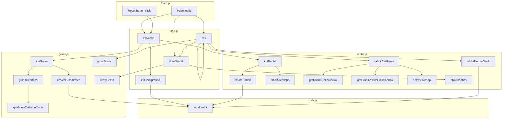

# school-project-ecosystem

## To-Do List

### Core Simulation
- [x] Växter växer
- [ ] Ett djur dör om den inte äter tillräckligt mycket
- [ ] Organismer blir större när den äter -> organismen blir långsammare
- [ ] Energinivå (för att springa)
- [ ] Ålder 
- [ ] Förökning
- [ ] Kön
- [ ] Sjukdomar (ärftligt)

### Food Chain
- [ ] Köttätare som äter växtätare
- [ ] Allätare
- [ ] Insekter?
- [ ] Det döda djuret tas upp av nedbrytare -> växter växer snabbare i närheten

### Behavior and AI
- [ ] Växtätare springer iväg från köttätare
- [ ] Djur kan bara se i en viss sträcka (beror på genetik och väder, alltså slump)
- [ ] Djur kan varna andra av samma art för hot (de springer om den springer iväg)

### World Systems
- [ ] Vatten som djur kan dricka ur
- [ ] Temperatur
- [ ] Väder (regn, sol, dimma)
- [ ] Dag- och nattcykel
- [ ] Olika klimat (öken, regnskog, osv)

### Tools and UX
- [ ] Statistik medan simuleringen sker
- [ ] Ett enkelt sätt att ändra alla olika funktioner (väder, temperatur, klimat, osv)

### Expansion
- [ ] Invasiva arter

### Goal
Mitt mål med det här projektet är att skapa en bra simulering som simulerar ett ekosystem basert på olika faktorer. Resultaten kommer användas till att undersöka hur ett ekosystem fungerar. 

## Function Relationship Diagram

Diagrammet nedan visar hur funktionerna i de aktiva skripten hänger ihop. Det är baserat på filerna som laddas av index.html: utils.js, grass.js, rabbit.js och app.js.

Kort förklaring:

- initWorld startar om världen genom att skapa gräs, bakgrund och kaniner.
- tick är huvudloopen som flyttar kaniner, låter dem äta gräs, växer gräs och ritar om världen varje bildruta.
- rabbitEatGrass använder hjälpfunktioner för kollisionskontroll mellan kaniner och synlig gräsyta.
- randomInt i utils.js används av gräs, kaniner och bakgrund för slumpmässiga värden.
- Diagrammet visar bara de skript som faktiskt används av sidan just nu.