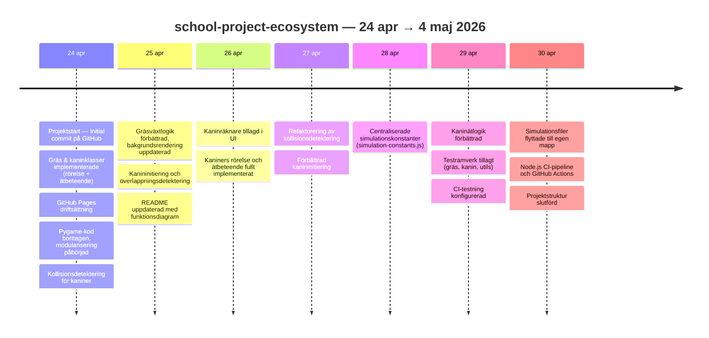

# Projekttidslinje

```mermaid
timeline
    title school-project-ecosystem — 24 apr → 4 maj 2026

    24 apr : Projektstart — Initial commit på GitHub
           : Gräs & kaninklasser implementerade (rörelse + ätbeteende)
           : GitHub Pages driftsättning
           : Pygame-kod borttagen, modularisering påbörjad
           : Kollisionsdetektering för kaniner

    25 apr : Gräsväxtlogik förbättrad, bakgrundsrendering uppdaterad
           : Kanininitiering och överlappningsdetektering
           : README uppdaterad med funktionsdiagram

    26 apr : Kaninräknare tillagd i UI
           : Kaniners rörelse och ätbeteende fullt implementerat

    27 apr : Refaktorering av kollisionsdetektering
           : Förbättrad kanininitiering

    28 apr : Centraliserade simulationskonstanter (simulation-constants.js)

    29 apr : Kaninätlogik förbättrad
           : Testramverk tillagt (gräs, kanin, utils)
           : CI-testning konfigurerad

    30 apr : Simulationsfiler flyttade till egen mapp
           : Node.js CI-pipeline och GitHub Actions
           : Projektstruktur slutförd
```
